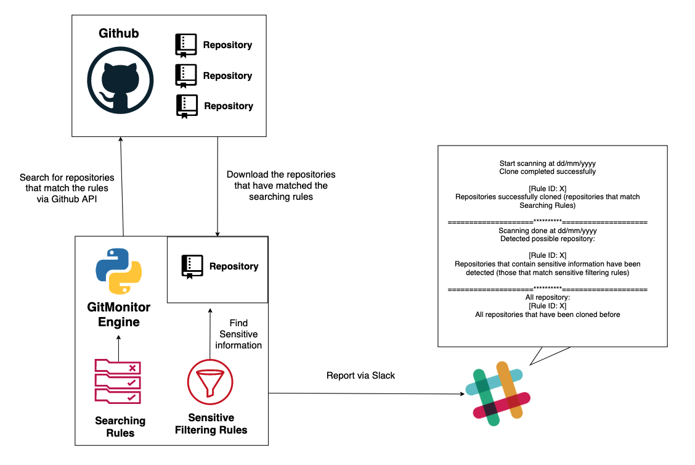
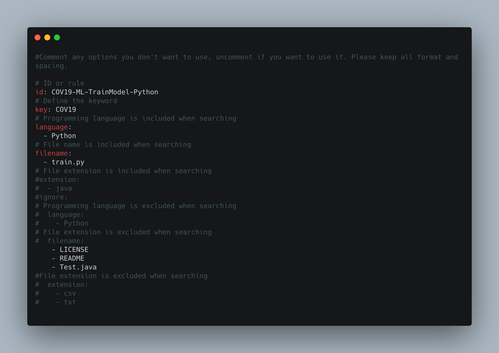

# GitMonitor

[](https://www.gnu.org/licenses/gpl-3.0)
<p align="center">
        
</p>

<center>
  <h1 style="text-align:center;">GitMonitor</h1>
  <h3 style="text-align:center;">One way to continuously monitor sensitive information that could be exposed on Github</h3>
</center>

## Summary

I know that there are many other tools available for finding sensitive information currently leaked on Github, I myself still use some of them. However, I think they still lack some features like:

+ Other tools are more focused on finding sensitive information that exists in a repository that has passed Git address into the tool. There are only a handful of similar tools at the time when I developed GitMonitor focused on `finding` repositories you need to care about first, find all relevant repositories, then `checking` to see if sensitive information exists among they are not.

+ In addition to rules for `checking sensitive information`, the tool also needs rules to `search for repositories of interest`. The repositories to be considered may be those that contain keywords related to the company or the project.

+ If you are a bug bounty hunter you will only be interested in several targets at a time. However, if you are a security engineer for a company, you will need to know when a repository related to your company or project appears and it may contain sensitive information. Such repositories can appear anywhere on Github, with any name and posted by any account. You should also receive an alert as soon as such a repository appears (continuously monitoring).

+ The tool has a flexible reporting mechanism.

That is why I created this tool - GitMonitor. GitMonitor uses two different sets of rules to find what you need. `The Searching ruleset` will search for repositories that may be related to your organization or internal projects, or anything else, clone repositories that matched to local. Then, `Sensitive filtering ruleset` to check if those repositories exist sensitive information. Finally the tool will report via Slack. You can use this tool with Cronjob to create a continuously monitoring system to track sensitive information related to your organization that leaked on Github and receive results via Slack.

<p align="center">
        
</p>

<p align="center">
        
</p>

## Features

+ Use two different sets of rules, a `searching rule set` (yaml) to search for the repository of interest, and a `set of filter rules` (regex) to check if those containers of interest contain sensitive information. Searching Rules (yaml) and Filtering Rules (regex) are defined separately. Users can define yaml rules and regex easily and intuitively.

+ `Searching rule set`: You can create many different rules by using different yaml files. Rules allow you to flexibly define how you want to search for repositories, you can use keywords, or keywords associated with the language, filename and extension or You can also define to exclude repositories from searching based on language, filename or extension. Keywords will be searched through the `names of the repositories`, `the codes of the repositories` and also `the commits`.

+ `Filtering rule set`: You can add or modify regexs easily to find sensitive information that may exist in repositories.

+ The first repository that have matched the searching ruleset will be clone to local. And then, filtering ruleset will check if this repository exist sensitive information. After finishing checking sensitive information, Gitmonitor will record the results and automatically delete this repository on local to save space before continuing to repeat this process until all relevant repositories have been found and checked.

+ Report via Slack.

+ This tool can be scheduled by Cronjob for continuous monitoring.



## Requirements

+ Python3
+ Python3-pip.
+ Tested on Ubuntu 18.04 and MacOS. We believe that Gitmonitor can work well on other systems as well

## Setup

### 1. Install requirements

```bash
> python3 -m pip install -r requirements.txt
```

Please make sure you have Pyyaml version 5x or higher installed (`pip3 install --ignore-installed PyYAML`)

### 2. Make sure you have configured all the necessary information in the configuration file (config.ini)

The following table explains the meaning of each key in the configuration file:

|  Key | Description|
|:---:|---|
|user|Github username - Leave blank if you have set up Github credentials via environment variables|
|pass|Github password - Leave blank if you have set up Github credentials via environment variables|
|webhooks|Incoming Webhook token to post messages from GitMonitor to Slack|
|rule|The directory contains the Searching rule set|
|source|The directory to download the repository|
|log|The directory will contain the JSON file that records the status after each scan, this JSON file is used to compare results between scans (To identify new repositories)|
|start|Define banner for start scanning and banner for result of Sensitive Filtering Ruleset scanning - Will show in the results that sent to Slack|
|end|Define banner for finish scanning and banner for result of Searching Ruleset scanning  - Will show in the results that sent to Slack|
|all|Define banner for showing all repositories - Will show in the results that sent to Slack|

### 3. Define Github account credentials. You have 2 ways to do this

+ Define credentials information in environment variables:

```bash
> export GIT_USERNAME=your Github username
> export GIT_PASSWORD=your Github personal key or password
```

+ Or define credentials information in configuration file (Not recommended):

  + Open config.ini file.
  + Fill in the credentials information to value of user and password keys.

Example configuration file when you define credentials information in environment variables


### 4. Write the rules (Searching rules). Put your rules in the rules directory

You can create many different yaml files like the rule template to define multiple keyword. A rule file will look like the image below:



### 5. Add more regular expressions to libs/regex.py file - Sensitive filtering rules (Optional)

### 6. Run Gitmonitor

```bash
> python3 gitmonitor.py
```

### 7. You can schedule automatic running for the tool by using Cronjob.

For example:


## To Do

+ [ ] Feature: Report via email.
+ [ ] Feature: Sent result to Elasticsearch.
+ [ ] Dev: Write setup.py
+ [ ] Dev: Write Dockerfile

## My Team

+ [Tony](https://github.com/crazykid95) - Project Lead
+ [musashi137](https://github.com/musashi137) - Core Dev

## Special Thanks

+ [GitMAD](https://github.com/deepdivesec/GitMAD) for regex-based sensitive information search mechanism

## Contributing

Many areas of this project could be improved and change significantly while refactoring current code and implementing new features. Feedback with improvements and pull requests from the community will be highly appreciated and accepted.

In general, we follow the "fork-and-pull" Git workflow.

1. Fork the repo on GitHub
2. Clone the project to your own machine
3. Commit changes to your own branch
4. Push your work back up to your fork
5. Submit a Pull request so that we can review your changes

NOTE: Be sure to merge the latest from "upstream" before making a pull request!

## Donate

<a href="https://www.buymeacoffee.com/tabcs" target="_blank"></a>